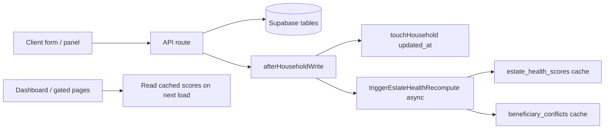
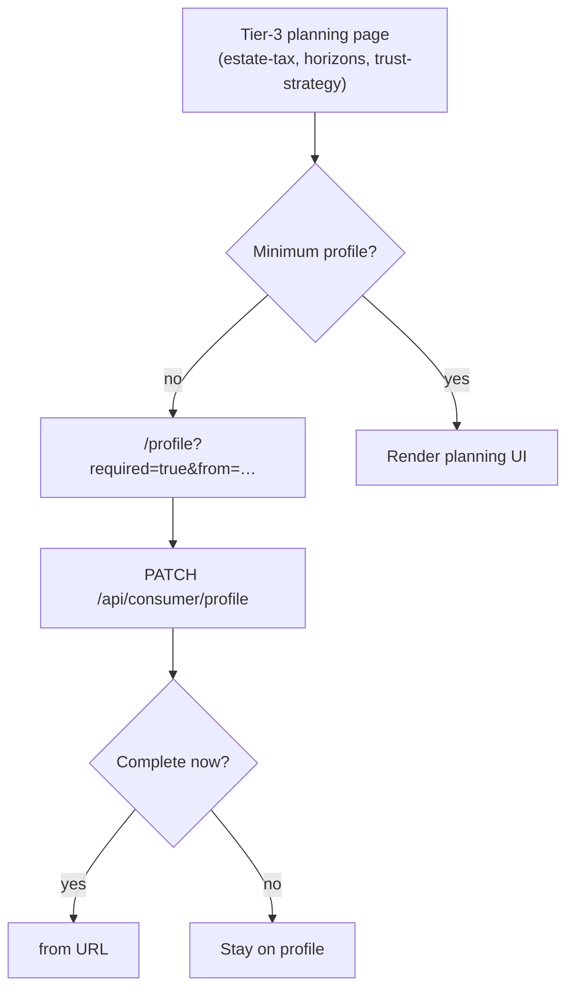

# Consumer flows

Journey-oriented reference for how consumers move through the app: **routes → server pages → write APIs → side effects → UI refresh**.

**Companion docs (do not duplicate here):**

| Doc | Use for |
|-----|---------|
| [CONSUMER_NAV_MAP.md](./CONSUMER_NAV_MAP.md) | Sidebar labels, URLs, tiers, feature keys, portal link visibility |
| [MASTER_ARCHITECTURE.md](./MASTER_ARCHITECTURE.md) | Consumer/advisor handoff, strategy/MC/access channels, migration status |
| [DATABASE_SCHEMA_REFERENCE.md](./DATABASE_SCHEMA_REFERENCE.md) | Current tables, RPCs, authoritative columns |
| [SCHEMA_CHANGELOG.md](./SCHEMA_CHANGELOG.md) | Session-by-session schema/app audit trail |
| [CONSUMER_RELEASE_SMOKE_TEST.md](./CONSUMER_RELEASE_SMOKE_TEST.md) | **Human** deploy verification (~10 min core; full ~30 min) |
| [UPDATE_CHECKLIST.md](./UPDATE_CHECKLIST.md) | **When and how to update** all docs (single maintenance guide) |

**Tier legend:** 1 = Financial, 2 = Retirement, 3 = Estate (`lib/tiers.ts`, `FEATURE_TIERS`).

---

## How writes propagate

Most consumer saves follow the same server-side pattern:



- **`lib/consumer/afterHouseholdWrite.ts`** — `touchHousehold` + non-blocking `triggerEstateHealthRecompute`.
- **Estate composition** — `classifyEstateAssets` → Postgres RPC `calculate_estate_composition` (server render or `POST /api/estate-composition`).
- **Horizons** — `buildStrategyHorizons` in `lib/my-estate-strategy/horizonSnapshots.ts` (fed by `strategy_line_items` + base-case projection).
- **Client refresh** — typically `router.refresh()` after save; composition/strategy totals may lag recompute by a few seconds (see e2e polls in `consumer-strategy-writes.spec.ts`).

---

## Flow template

Each feature section below uses this shape:

| Field | Meaning |
|-------|---------|
| **User goal** | What the consumer is trying to accomplish |
| **Tier / gate** | Minimum tier; profile gate yes/no |
| **Server** | `page.tsx` data loading |
| **Client** | Interactive component |
| **Write APIs** | Mutations |
| **Read APIs / RPCs** | Reads used on the page |
| **After save** | Side effects and how UI updates |
| **Key lib** | Shared logic |
| **E2E** | Playwright spec (living contract) |
| **Empty / blocked** | Upgrade banner, profile redirect, empty states |

---

## 0. Public marketing flows

### Planning assessment — `/assess`

| | |
|--|--|
| **User goal** | Self-assess planning readiness across financial, retirement, and estate pillars |
| **Tier / gate** | None (public) |
| **Client** | `app/(public)/assess/page.tsx` |
| **Write APIs** | `assessment_results` insert when logged in; `mwm_pending_assessment` in `localStorage` when logged out |
| **Gating** | Logged-out: overall score + pillar % visible; gap report / next steps require signup or login |
| **After auth** | Pending payload restored and inserted (30-minute window) |

### Life event assessment — `/event/[slug]/assess`

| | |
|--|--|
| **User goal** | Event-specific readiness score (5 questions) |
| **Tier / gate** | None (public) |
| **Client** | `app/(public)/event/[slug]/assess/page.tsx` |
| **Write APIs** | `POST /api/email-capture` when anonymous; `assessment_results` when logged in (`answers._event_slug`) |
| **Content** | `lib/events/content.ts` per slug |

---

## 1. Auth and onboarding

### Login — `/login`

| | |
|--|--|
| **User goal** | Sign in to the dashboard app |
| **Tier / gate** | None |
| **Server** | `app/(auth)/login/page.tsx` |
| **Client** | `app/(auth)/login/_login-form.tsx` |
| **Write APIs** | Supabase Auth (not app REST) |
| **After save** | Redirect to `/dashboard` (or return URL) |
| **E2E** | Covered in smoke test §1 ([CONSUMER_RELEASE_SMOKE_TEST.md](./CONSUMER_RELEASE_SMOKE_TEST.md)) |

### Profile — `/profile`

| | |
|--|--|
| **User goal** | Household setup: names, birth years, filing status, domicile, growth assumptions |
| **Tier / gate** | Tier 1; **not** profile-gated (this is where users complete the gate) |
| **Server** | `app/(dashboard)/profile/page.tsx` — loads `profiles` + `households`; passes `?required=true&missing=…&from=…` to client |
| **Client** | `app/(dashboard)/profile/_profile-client.tsx`, `profile/_profile-required-banner.tsx` |
| **Write APIs** | `PATCH /api/consumer/profile` |
| **After save** | `afterHouseholdWrite`; redirect: if `required=true` and minimum profile complete → `from` param; if MVP complete (new household or existing) → `/onboarding/invite-advisor`; else `/dashboard` or `/health-check` |
| **Key lib** | `lib/estate/profileGate.ts` (`isMinimumViableProfile`), `lib/profile/buildHouseholdPayload.ts` |
| **E2E** | Implicit via gated-page tests; manual smoke §3 |

**Minimum viable profile** (required for estate planning pages):

| Field | Source |
|-------|--------|
| `state_primary` | Household domicile |
| `filing_status` | Tax filing status |
| Primary DOB | `person1_birth_year` **or** legacy `date_of_birth_1` |

Server redirect when incomplete: `requireMinimumViableProfile` → `/profile?required=true&missing=state_primary,filing_status,…&from=/estate-tax` (`lib/estate/requireMinimumProfile.ts`).

### Invite your advisor — `/onboarding/invite-advisor`

| | |
|--|--|
| **User goal** | Invite an existing advisor or skip; completes post-profile onboarding gate |
| **Tier / gate** | Consumers only; requires MVP profile; blocked when `onboarding_invite_advisor_completed_at` is set |
| **Server** | `app/(dashboard)/onboarding/invite-advisor/page.tsx` |
| **Client** | `_invite-advisor-client.tsx` — mailto invite, link to `/find-advisor`, skip |
| **Write APIs** | `POST /api/consumer/onboarding-invite-advisor` — skip and continue both set `onboarding_invite_advisor_completed_at` |
| **Layout gate** | `(dashboard)/layout.tsx` + `InviteAdvisorOnboardingGate` redirect until column set |
| **Migration** | `profiles.onboarding_invite_advisor_completed_at` in `20260530000000_sprint9_10_gates.sql` |

### Business succession — `/business-succession`

| | |
|--|--|
| **User goal** | Document succession plan, key-person dependency, buy-sell status (minimal intake) |
| **Tier / gate** | Tier 3 (`FEATURE_TIERS['business-succession']`); `UpgradeBanner` when below tier |
| **Write APIs** | `PATCH /api/consumer/succession-intake` → `households.succession_*` |
| **Dashboard** | Amber alert when business interests exist and `succession_plan_in_place` is not true |



**Not profile-gated:** `/dashboard`, `/profile`, tier-1 financial intake (`/assets`, `/income`, …), `/health-check`.

**Profile-gated (tier 3 + minimum profile):**

| Route | Server gate |
|-------|-------------|
| `/estate-tax` | `requireMinimumViableProfile(household, '/estate-tax')` |
| `/my-estate-strategy` | `requireMinimumViableProfile(household, '/my-estate-strategy')` |
| `/my-estate-trust-strategy` | `requireMinimumViableProfile(householdRow, '/my-estate-trust-strategy')` |

Other tier-3 routes (e.g. `/my-family`, `/titling`) use **tier upgrade banners** only, not the minimum-profile redirect.

---

## 2. Financial intake (tier 1–2)

Consumers build the household balance sheet and cash flows before estate surfaces become meaningful.

### Dashboard hub — `/dashboard`

| | |
|--|--|
| **User goal** | Net worth, retirement snapshot, estate readiness, advisor recommendations, setup progress |
| **Tier / gate** | Tier 1; **no** profile gate; shows `DashboardEmptyState` if no household |
| **Server** | `app/(dashboard)/dashboard/page.tsx` — loaders in `lib/dashboard/loaders.ts`; may trigger async base-case regen when projection stale |
| **Client** | `app/(dashboard)/_dashboard-client.tsx`, `dashboard/_components/*` |
| **Write APIs** | None on dashboard (read-only hub) |
| **Read APIs / RPCs** | `classifyEstateAssets`, `generate_estate_recommendations`, cached `estate_health_scores`, `beneficiary_conflicts`, `strategy_line_items` (advisor pending), `advisor_projection_assumptions` (MC share) |
| **After save** | N/A; **other pages’** writes eventually refresh score via recompute |
| **Key lib** | `lib/dashboard/*`, `components/dashboard/EmptyStateCard.tsx` |
| **E2E** | `tests/e2e/consumer/dashboard.spec.ts` |
| **Key UI sections** | Greeting + setup progress (`DashboardIntroSection`); **`LifeEventBanner`** (log event → `POST /api/consumer/life-events`, calendar triggers from cron); **conflict severity chips**; dismissible conflict alert banner; `AssessmentHistoryWidget`; Financial Summary / Net Worth; `EstateCalloutCard`; `StrategyRecommendationPanel`; `MonteCarloScenarioBanner` |
| **Life event write** | `POST /api/consumer/life-events` → `afterHouseholdWriteForOwner` → estate health recompute |
| **Empty / blocked** | No household → empty state; `grossEstate === 0` → estate callout empty state; no retirement accounts → retirement empty state; no conflicts → banner/chips hidden |

### Financial modules (representative)

| Route | Client | Write API | Notes |
|-------|--------|-----------|--------|
| `/assets` | `_assets-client.tsx` | `/api/consumer/assets` | CRUD |
| `/income` | income client | `/api/consumer/income` | |
| `/expenses` | expenses client | `/api/consumer/expenses` | |
| `/liabilities` | liabilities client | `/api/consumer/liabilities` | |
| `/real-estate` | real estate client | `/api/consumer/real-estate` | |
| `/digital-assets` | `DigitalAssetIntakeForm` | `/api/consumer/digital-assets` | Tier 2; `FEATURE_TIERS['digital-assets']`; `UpgradeBanner` when below tier |
| `/businesses` | `_business-form-client.tsx` | `/api/businesses`, `/api/businesses/[id]` | Legacy top-level routes; `afterHouseholdWriteForOwner` |
| `/insurance`, `/property-casualty` | insurance form clients | `/api/insurance`, `/api/insurance/[id]` | Same pattern as businesses |
| `/rmd` | `rmd/_rmd-client.tsx` | Read-only (client-side projection from assets + household) | Tier 2; RMD start age from `getRmdStartAge(personN_birth_year)` — **75** if born ≥1960, **73** if 1951–1959, **72** if ≤1950 |
| `/roth` | `roth/_roth-client.tsx` | Read-heavy; uses projection + `getRmdStartAge` for conversion window | Tier 2 |

**Dashboard RMD strip:** `lib/dashboard/rmdStatus.ts` — `p1StartYear` / `p2StartYear` = birth year + `getRmdStartAge`; `calcRmdAmount` only when current age ≥ cohort start age.

All normalized consumer CRUD routes call **`afterHouseholdWrite`** on success (see `tests/e2e/consumer/consumer-financial-writes.spec.ts`).

### Planning surfaces — projections, lifetime snapshot, scenarios (Sprint 11)

Three related routes share projection engines but answer different questions. **`PlanningSurfaceNav`** (`lib/planning/planningSurfaces.ts`) links them on every surface.

| Route | Tier | Role | Discoverability |
|-------|------|------|-----------------|
| `/projections` | 1 | Retirement-focused summary cards + chart/table/income tabs | **ScenariosExploreCard** → `/scenarios` below summary cards |
| `/complete` | 2 | Full year-by-year `YearRow` table (expandable column groups) | Nav pills → projections / scenarios |
| `/scenarios` | 1 | Side-by-side what-if (base + B + C); saves via `POST /api/consumer/scenario-snapshots` | Nav pills → projections / lifetime |

| Route | Data load | Empty state CTA |
|-------|-----------|-----------------|
| `/projections` | `loadProjectionData` → `ProjectionsClient` | `PLANNING_MISSING_PROJECTION_ACTIONS_TIER2` — profile only |
| `/complete` | `loadProjectionData` → `CompleteClient` | Same — rows from `computeCompleteProjection`, not `generate-base-case` |
| `/scenarios` | `loadProjectionData` + client variant query strings | (scenario-specific UI) |

**Generate base case** (`POST /api/consumer/generate-base-case`) is for tier-3 **`/my-estate-strategy`** horizons (`projection_scenarios`), not for populating `/projections` or `/complete`.

### Dashboard mobile shell (Sprint 12)

Consumer routes under `app/(dashboard)/` use **`DashboardShell`**: sidebar is fixed on `lg+` desktops; below `lg`, a top bar opens an off-canvas drawer (overlay, closes on navigation). Public routes (`(public)/layout`) are unchanged. Complex modeling is desktop-first; a brief note appears in the mobile sidebar footer.

### Dashboard persona alerts (Sprint 12)

On `/dashboard` load, `buildPersonaDashboardAlerts()` derives from existing `loadDashboardCoreInputs` payload (no extra query):

| Alert | Condition | CTA |
|-------|-----------|-----|
| Business $5M / $10M | `computeBusinessOwnershipValue` ≥ threshold | `/business-succession` |
| Multi-state RE | ≥2 distinct non-empty `real_estate.situs_state` | `/real-estate` |

### Health check — `/health-check`

| | |
|--|--|
| **User goal** | Onboarding checklist / estate health questionnaire |
| **Tier / gate** | Linked from dashboard; not profile-gated |
| **Write APIs** | `POST /api/consumer/estate-health-check` (and related) |
| **After save** | Recompute path same as other household writes |

---

## 3. Estate planning surfaces (tier 3)

### Estate Tax Snapshot — `/estate-tax`

| | |
|--|--|
| **User goal** | Federal/state estate tax exposure from current balance sheet |
| **Tier / gate** | Tier 3; **profile gate** |
| **Server** | `app/(dashboard)/estate-tax/page.tsx` — assets, RE, liabilities, trusts, brackets; `classifyEstateAssets` |
| **Client** | `app/(dashboard)/estate-tax/_estate-tax-client.tsx` |
| **Write APIs** | Read-heavy; trust edits may use consumer trust API from other flows |
| **Read APIs / RPCs** | `calculate_estate_composition` via `classifyEstateAssets` |
| **Key lib** | `lib/calculations/estate-tax.ts`, `lib/estate/exemptionLabels.ts` |
| **Empty / blocked** | `UpgradeBanner` if `tier < 3`; optional `householdContext` (`grossEstate`, `statePrimary`) for personalized copy when estate ≥ $100K |

### Estate Value and Tax Horizons — `/my-estate-strategy`

| | |
|--|--|
| **User goal** | Horizon table: today → longevity; federal/state tax bands; strategy line impact |
| **Tier / gate** | Tier 3; **profile gate**; `UpgradeBanner` + `householdContext` if `tier < 3` |
| **Server** | `app/(dashboard)/my-estate-strategy/page.tsx` — staleness-based base-case regen; `buildStrategyHorizons`, `classifyEstateAssets` |
| **Client** | `app/(dashboard)/my-estate-strategy/_my-estate-strategy-client.tsx`, `EstatePlanningDashboard` |
| **Write APIs** | Strategy changes usually on trust-strategy page; base case via `POST /api/consumer/generate-base-case` when needed |
| **Read APIs / RPCs** | `strategy_line_items`, `projection_scenarios.outputs_s1_first`, `state_estate_tax_rules` |
| **Key lib** | `lib/my-estate-strategy/horizonSnapshots.ts` |
| **UX** | Collapsible **Estate value & tax horizons**: labeled stepper (Actual vs What-if); **hero tax cards** + **comparison table** (not card-per-column); estate conflicts anchor `#estate-conflicts` on embedded completeness section |
| **Empty / blocked** | Amber banner if federal horizon inputs missing (needs base-case projection) |

### Gifting, Strategies & Trusts — `/my-estate-trust-strategy?tab=…`

This page is a **two-level** navigation system: primary tabs (URL-driven) plus client-only sub-navigation inside several tabs.

| | |
|--|--|
| **User goal** | Annual gifting, charitable giving, transfer strategies, trusts & documents in one workspace |
| **Tier / gate** | Tier 3; **profile gate**; `UpgradeBanner` if `tier < 3` |
| **Server** | `app/(dashboard)/my-estate-trust-strategy/page.tsx` — heavy parallel fetch: gifting RPC, line items, trust guidance, horizons, composition |
| **Client** | `app/(dashboard)/my-estate-trust-strategy/_client.tsx` — tab state + `router.replace(?tab=)` (no full route per tab) |
| **Primary tabs** | `gifting` · `charitable` · `strategies` · `trusts` |

```text
/my-estate-trust-strategy?tab={gifting|charitable|strategies|trusts}
  ├── gifting      → GiftingDashboard
  ├── charitable   → CharitableGivingDashboard (+ sub-tabs, client state)
  ├── strategies   → ConsumerStrategyPanel (+ strategy pills, client state)
  └── trusts       → TrustDocumentsPanel + educational planning topics
```

**Legacy redirect:** `/trust-will` → `/my-estate-trust-strategy?tab=trusts`

#### Tab: Annual Gifting (`?tab=gifting`)

| | |
|--|--|
| **Client** | `components/GiftingDashboard.tsx` (dynamic import) |
| **Write APIs** | `POST/PATCH/DELETE /api/consumer/gift-history`; annual program via `POST /api/strategy-line-items` (`strategy_source: annual_gifting`) |
| **Read APIs / RPCs** | `calculate_gifting_summary`, `gift_history` for current tax year |
| **UX (not separate routes)** | Lifetime exemption meter; per-recipient annual cap warnings (amber when over limit); **Prior taxable gifts (Form 709)** collapsible (`gift_type='lifetime'`); MFJ donor selector; **Save to my plan →** / **Compare a second scenario** on parent `_client.tsx` |
| **E2E** | `tests/e2e/consumer/consumer-gift-history.spec.ts`, strategy sections of `consumer-strategy-writes.spec.ts` |

#### Tab: Charitable Giving (`?tab=charitable`)

| | |
|--|--|
| **Client** | `components/CharitableGivingDashboard.tsx` |
| **Sub-tabs (client state)** | **Planning topics** · **Deduction Detail** · **Donation History** — not in URL; `useState<'topics' \| 'deductions' \| 'history'>` (default: Planning topics); sub-nav renders after client hydration |
| **Read APIs / RPCs** | `calculate_charitable_summary(p_household_id)` — summary cards, `recommendations[]`, `deduction_detail`, `donation_history`, optional QCD eligibility |
| **Above sub-tabs (always visible)** | Four summary cards (total donated, tax deductible, QCD, capital gains avoided); optional QCD eligibility banner; **Log a Donation** modal; **Save to my plan →** on total donated (`strategy_source: daf`) |
| **Planning topics** | RPC `recommendations[]` when donations exist; if `donation_count === 0`, **`buildPersonalizedCharitableTopics(householdContext)`** from state, filing status, ages, pre-IRA balance (passed from trust-strategy `page.tsx`); client filters TCJA/sunset strings on RPC topics |
| **Deduction Detail** | `deduction_detail`: itemizing vs standard, AGI limits (60% cash / 30% assets), deductible amounts, carryforward |
| **Donation History** | `donation_history[]` table with delete; empty copy “No donations logged yet…” (distinct from planning-topics empty) |
| **Write APIs** | Donation insert/delete via Supabase `charitable_donations` from component (not `/api/consumer/*`); **Save to my plan →** → `POST /api/strategy-line-items` (`strategy_source: daf` or `charitable`, `scenario_name: base`); DAF panel also uses `CharitableStrategyForm` on Transfer Strategies tab |
| **After save** | `afterHouseholdWrite` on line-item route; `router.refresh()`; composition `outside_strategy_total` may lag — e2e polls `POST /api/estate-composition` up to ~20s |
| **E2E** | `consumer-strategy-writes.spec.ts` (DAF / charitable) |

#### Tab: Transfer Strategies (`?tab=strategies`)

| | |
|--|--|
| **Client** | `components/consumer/ConsumerStrategyPanel.tsx`, `StrategyHorizonTable`, advisor recommendation block on `_client.tsx` |
| **Sub-nav (client state)** | Strategy **pills**: GRAT, CRT, CLAT, DAF, Liquidity, Roth Conversion, SLAT, ILIT — selects panel; not URL segments |
| **Write APIs** | `POST/PATCH/DELETE /api/strategy-line-items`; `PATCH /api/consumer/strategy-recommendation` (accept advisor line); SLAT/ILIT via `lib/consumer/consumerStrategyLineItems.ts` |
| **Read** | Server-prefetched `estateContext`, `strategyImpact`, `advisorHorizons` |
| **Advisor block** | “Advisor Recommended Strategies” — pending `strategy_line_items` (`source_role='advisor'`, not rejected); empty copy when none |
| **Education CTA** | **Ask your advisor about this →** in each strategy’s “About this strategy” card → `/find-advisor` (directory only; does not notify linked advisor) |
| **Key lib** | Strategy categories must match DB check constraint (see e2e file header) |
| **E2E** | `consumer-strategy-writes.spec.ts` |

#### Tab: Trusts & Documents (`?tab=trusts`)

| | |
|--|--|
| **Client** | `components/consumer/TrustDocumentsPanel.tsx` |
| **Summary strip** | Estimated Taxable Estate, Federal Exemption Remaining, Headroom Before Federal Tax (annotated with lifetime gifts used when applicable) |
| **Write APIs** | `POST/PATCH/DELETE /api/consumer/trusts` |
| **Read** | `loadTrustWillGuidance` — trusts, recommendations, checklist; `trustEstateSummary` from composition + gifting RPC |
| **Educational UI** | Common planning topics (Pour-Over Will, Business Succession Trust, etc.) via `lib/estate/planningTopicPresentation.ts` — framing only, not personalized advice |
| **Key lib** | `lib/trusts/trustPayload.ts`, `lib/trusts/trustEstateTaxEstimate.ts` (`excludes_from_estate`, `~Est. Tax Saved`) |
| **E2E** | `tests/e2e/consumer/consumer-trust-crud.spec.ts` |

**Advisor overlay on this page:**

- `strategy_configs` → in-app `advisor_strategy_recommended` notifications
- Pending advisor `strategy_line_items` → accept/reject on strategies tab + dashboard panel
- Horizon federal values require base-case projection; missing context shows amber server banner

---

## 4. Other tier-3 intake (not profile-gated)

These use tier checks in `page.tsx` / sidebar gating but **do not** call `requireMinimumViableProfile` today:

| Route | Focus | Typical writes |
|-------|--------|----------------|
| `/my-family` | Household people | `/api/consumer/household-people` |
| `/titling` | Beneficiaries, entity titling | `/api/consumer/asset-beneficiaries`, `/api/consumer/entity-titling` |
| `/incapacity-planning` | POA / healthcare directives | Page-specific APIs |
| `/domicile-analysis` | State comparison | Server + client calculators |

See [CONSUMER_NAV_MAP.md](./CONSUMER_NAV_MAP.md) for the full route list.

---

## 5. Advisor ↔ consumer handoff

Full channel reference: [MASTER_ARCHITECTURE.md → Consumer and advisor interaction](./MASTER_ARCHITECTURE.md#consumer-and-advisor-interaction).

| Channel | Consumer surface | API / data |
|---------|------------------|------------|
| **Strategy recommendations** | Dashboard `StrategyRecommendationPanel`; trust-strategy **Transfer Strategies** (“Advisor Recommended Strategies”) | Advisor: `/api/advisor/strategy-recommendation`. Consumer accept: `PATCH /api/consumer/strategy-recommendation`. Reject: `DELETE` same. Rows: `strategy_line_items` `source_role='advisor'` |
| **Monte Carlo** | `MonteCarloScenarioBanner` on `/dashboard`, `/my-estate-strategy` | `/api/monte-carlo/advisor-assumptions`; table `advisor_projection_assumptions` |
| **Access** | `/my-advisor` (sidebar footer) | `advisor_clients`, `connection_requests`, `advisor_directory`; invite-via-email when no connection; cancel pending via `POST /api/connection-requests/cancel` |
| **Life event → advisor** | `LifeEventBanner` confirmation | `POST /api/consumer/life-events` notifies connected advisor (`create_notification`); cron backup in `/api/cron/notifications` |
| **Plan readiness (advisor view)** | Advisor client Overview tab | `estate_health_scores` via `fetchHealthScore` → `PlanReadinessCard` |
| **Export for attorney** | `/print` (tier 3+) | `ExportPDFButton` `variant=attorney` → `AttorneyEstatePlanPDF` via `/api/export-estate-plan?variant=attorney` |
| **Advisor event referral** | `/event/[slug]?ref=` | `_referral-tracker.tsx` → `POST /api/referral/track` (`type: 'advisor'`) → `referral_clicks` |
| **Attorney event referral** | `/event/[slug]?aref=` | Same tracker → `type: 'attorney'` → `attorney_listing_id` / `attorney_profile_id` |
| **Advisor newsletter kit** | Advisor portal | `buildAllEventReferralUrls` — 24 `?ref=` links |
| **Attorney newsletter kit** | Attorney portal `/attorney` | `buildAllAttorneyEventReferralUrls` — 24 `?aref=` links |
| **Signup attribution** | `/signup` after `signUp` + `signInWithPassword` | `_signup-form.tsx` → `profiles` + `POST /api/analytics/funnel` (`account_created`); both advisor and attorney session keys |
| **Funnel analytics** | All public funnel steps | `captureFunnelEvent()` → `POST /api/analytics/funnel` → `funnel_events`; admin **Funnel** tab — 30-day step counts, tier conversion, slug/referral tables |
| **Email drip** | Event assess email capture | 3-step sequence per event slug (24 custom in `drip-templates.ts`); `POST /api/email-capture` → drip step 1; steps 2–3 cron |
| **SEO** | Public marketing URLs | `app/sitemap.ts` ready; **pre-launch** `app/robots.ts` blocks all crawlers; `proxy.ts` allows `/education`, `/sitemap.xml`, `/robots.txt` without login |
| **Assess results gate** | `/assess` results (logged out) | Scores always visible; gap report + next steps require account (Sprint 12 — `score_visible` only) |
| **Notifications** | In-app | `advisor_strategy_recommended` when new `strategy_configs` appear on trust-strategy load |
| **Find advisor (not handoff)** | **Ask your advisor about this →** on strategy education cards | Links to `/find-advisor` only — no message to connected advisor |

**Computation parity:** Accepted advisor lines + consumer lines feed `buildStrategyHorizons` and `calculate_estate_composition` so federal/state figures align with advisor client view (same household snapshot).

---

## 6. API quick reference

### Normalized consumer writes (`/api/consumer/*`)

| Route | Domain |
|-------|--------|
| `profile` | Household + profile |
| `assets`, `income`, `expenses`, `liabilities`, `real-estate`, `digital-assets` | Balance sheet / cash flow |
| `gift-history` | Annual gift log |
| `trusts` | Trust CRUD |
| `strategy-recommendation` | Accept advisor strategy line |
| `asset-beneficiaries`, `entity-titling`, `household-people` | Titling / family |
| `allocation-targets`, `scenario-snapshots`, `generate-base-case` | Projections / allocation |
| `estate-health-check` | Health questionnaire |
| `life-events` | Log / list / acknowledge in-app life events |

### Shared / legacy writes

| Route | Used by |
|-------|---------|
| `/api/strategy-line-items` | Gifting, charitable, strategies (consumer + advisor roles) |
| `/api/businesses`, `/api/insurance` | Business and life/P&C forms |
| `/api/estate-composition` | Client refresh of composition card; e2e assertions |

### Key read RPCs

| RPC | Used for |
|-----|----------|
| `calculate_estate_composition` | Gross estate, buckets, strategy totals, tax estimates |
| `calculate_gifting_summary` | Annual/lifetime gifting limits |
| `generate_estate_recommendations` | Dashboard action items |

---

## 7. E2E map (living contracts)

| Spec | Covers |
|------|--------|
| `tests/e2e/consumer/dashboard.spec.ts` | Dashboard load, net worth, disclaimer |
| `tests/e2e/consumer/consumer-financial-writes.spec.ts` | Consumer CRUD: assets, income, expenses, RE, liabilities |
| `tests/e2e/consumer/consumer-api-writes.spec.ts` | Additional API smoke |
| `tests/e2e/consumer/consumer-strategy-writes.spec.ts` | Strategy line items, charitable, recommendations |
| `tests/e2e/consumer/consumer-trust-crud.spec.ts` | `/api/consumer/trusts` |
| `tests/e2e/consumer/consumer-gift-history.spec.ts` | Gift history API |
| `tests/e2e/consumer/consumer-titling.spec.ts` | Titling / beneficiaries |

Strategy e2e requires `PLAYWRIGHT_HOUSEHOLD_ID` in the environment.

**Automated vs manual:** E2E specs are living contracts for APIs and key UI loads. Post-deploy human checks (login, save, recompute, gated profile redirect) live in [CONSUMER_RELEASE_SMOKE_TEST.md](./CONSUMER_RELEASE_SMOKE_TEST.md) — do not skip for production releases.

---

## Document maintenance

When consumer behavior changes, follow **[UPDATE_CHECKLIST.md](./UPDATE_CHECKLIST.md)** (single source for what to update and verification steps). This file holds journey detail only.

---

*Last structured pass: Session 127+ (profile gate, trust-strategy sub-nav, advisor handoff, doc consolidation).*
