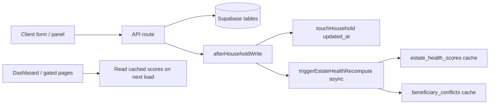
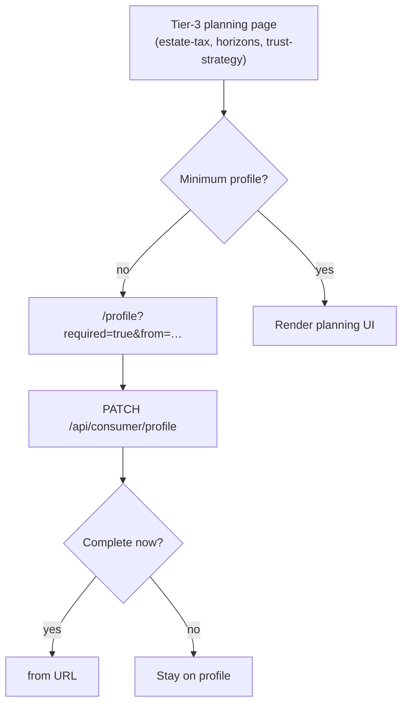

# Consumer flows

Journey-oriented reference for how consumers move through the app: **routes → server pages → write APIs → side effects → UI refresh**.

**Companion docs (do not duplicate here):**

| Doc | Use for |
|-----|---------|
| [CONSUMER_NAV_MAP.md](./CONSUMER_NAV_MAP.md) | Sidebar labels, URLs, tiers, feature keys |
| [MASTER_ARCHITECTURE.md](./MASTER_ARCHITECTURE.md) | Cross-cutting contracts (strategy merge, horizons, Monte Carlo, advisor parity) |
| [DATABASE_SCHEMA_REFERENCE.md](./DATABASE_SCHEMA_REFERENCE.md) | Tables, RPCs, migrations |
| [CONSUMER_RELEASE_SMOKE_TEST.md](./CONSUMER_RELEASE_SMOKE_TEST.md) | Manual deploy verification |
| [UPDATE_CHECKLIST.md](./UPDATE_CHECKLIST.md) | When to update which doc |

**Tier legend:** 1 = Financial, 2 = Retirement, 3 = Estate (`lib/tiers.ts`, `FEATURE_TIERS`).

---

## How writes propagate

Most consumer saves follow the same server-side pattern:

- **`lib/consumer/afterHouseholdWrite.ts`** — `touchHousehold` + non-blocking `triggerEstateHealthRecompute`.
- **Estate composition** — `classifyEstateAssets` → Postgres RPC `calculate_estate_composition` (server render or `POST /api/estate-composition`).
- **Horizons** — `buildStrategyHorizons` in `lib/my-estate-strategy/horizonSnapshots.ts` (fed by `strategy_line_items` + base-case projection).
- **Client refresh** — typically `router.refresh()` after save; composition/strategy totals may lag recompute by a few seconds (see e2e polls in `consumer-strategy-writes.spec.ts`).

---

## Flow template

Each feature section below uses this shape:

| Field | Meaning |
|-------|---------|
| **User goal** | What the consumer is trying to accomplish |
| **Tier / gate** | Minimum tier; profile gate yes/no |
| **Server** | `page.tsx` data loading |
| **Client** | Interactive component |
| **Write APIs** | Mutations |
| **Read APIs / RPCs** | Reads used on the page |
| **After save** | Side effects and how UI updates |
| **Key lib** | Shared logic |
| **E2E** | Playwright spec (living contract) |
| **Empty / blocked** | Upgrade banner, profile redirect, empty states |

---

## 1. Auth and onboarding

### Login — `/login`

| | |
|--|--|
| **User goal** | Sign in to the dashboard app |
| **Tier / gate** | None |
| **Server** | `app/(auth)/login/page.tsx` |
| **Client** | `app/(auth)/login/_login-form.tsx` |
| **Write APIs** | Supabase Auth (not app REST) |
| **After save** | Redirect to `/dashboard` (or return URL) |
| **E2E** | Covered in smoke test §1 ([CONSUMER_RELEASE_SMOKE_TEST.md](./CONSUMER_RELEASE_SMOKE_TEST.md)) |

### Profile — `/profile`

| | |
|--|--|
| **User goal** | Household setup: names, birth years, filing status, domicile, growth assumptions |
| **Tier / gate** | Tier 1; **not** profile-gated (this is where users complete the gate) |
| **Server** | `app/(dashboard)/profile/page.tsx` — loads `profiles` + `households`; passes `?required=true&missing=…&from=…` to client |
| **Client** | `app/(dashboard)/profile/_profile-client.tsx`, `profile/_profile-required-banner.tsx` |
| **Write APIs** | `PATCH /api/consumer/profile` |
| **After save** | `afterHouseholdWrite`; redirect: if `required=true` and minimum profile complete → `from` param; else `/dashboard` or `/health-check` |
| **Key lib** | `lib/estate/profileGate.ts` (`isMinimumViableProfile`), `lib/profile/buildHouseholdPayload.ts` |
| **E2E** | Implicit via gated-page tests; manual smoke §3 |

**Minimum viable profile** (required for estate planning pages):

| Field | Source |
|-------|--------|
| `state_primary` | Household domicile |
| `filing_status` | Tax filing status |
| Primary DOB | `person1_birth_year` **or** legacy `date_of_birth_1` |

Server redirect when incomplete: `requireMinimumViableProfile` → `/profile?required=true&missing=state_primary,filing_status,…&from=/estate-tax` (`lib/estate/requireMinimumProfile.ts`).

**Not profile-gated:** `/dashboard`, `/profile`, tier-1 financial intake (`/assets`, `/income`, …), `/health-check`.

**Profile-gated (tier 3 + minimum profile):**

| Route | Server gate |
|-------|-------------|
| `/estate-tax` | `requireMinimumViableProfile(household, '/estate-tax')` |
| `/my-estate-strategy` | `requireMinimumViableProfile(household, '/my-estate-strategy')` |
| `/my-estate-trust-strategy` | `requireMinimumViableProfile(householdRow, '/my-estate-trust-strategy')` |

Other tier-3 routes (e.g. `/my-family`, `/titling`) use **tier upgrade banners** only, not the minimum-profile redirect.

---

## 2. Financial intake (tier 1–2)

Consumers build the household balance sheet and cash flows before estate surfaces become meaningful.

### Dashboard hub — `/dashboard`

| | |
|--|--|
| **User goal** | Net worth, retirement snapshot, estate readiness, advisor recommendations, setup progress |
| **Tier / gate** | Tier 1; **no** profile gate; shows `DashboardEmptyState` if no household |
| **Server** | `app/(dashboard)/dashboard/page.tsx` — loaders in `lib/dashboard/loaders.ts`; may trigger async base-case regen when projection stale |
| **Client** | `app/(dashboard)/_dashboard-client.tsx`, `dashboard/_components/*` |
| **Write APIs** | None on dashboard (read-only hub) |
| **Read APIs / RPCs** | `classifyEstateAssets`, `generate_estate_recommendations`, cached `estate_health_scores`, `beneficiary_conflicts`, `strategy_line_items` (advisor pending), `advisor_projection_assumptions` (MC share) |
| **After save** | N/A; **other pages’** writes eventually refresh score via recompute |
| **Key lib** | `lib/dashboard/*`, `components/dashboard/EmptyStateCard.tsx` |
| **E2E** | `tests/e2e/consumer/dashboard.spec.ts` |
| **Empty / blocked** | No household → empty state; `grossEstate === 0` → estate callout empty state; no retirement accounts → retirement empty state |

### Financial modules (representative)

| Route | Client | Write API | Notes |
|-------|--------|-----------|--------|
| `/assets` | `_assets-client.tsx` | `/api/consumer/assets` | CRUD |
| `/income` | income client | `/api/consumer/income` | |
| `/expenses` | expenses client | `/api/consumer/expenses` | |
| `/liabilities` | liabilities client | `/api/consumer/liabilities` | |
| `/real-estate` | real estate client | `/api/consumer/real-estate` | |
| `/digital-assets` | `DigitalAssetIntakeForm` | `/api/consumer/digital-assets` | |
| `/businesses` | `_business-form-client.tsx` | `/api/businesses`, `/api/businesses/[id]` | Legacy top-level routes; `afterHouseholdWriteForOwner` |
| `/insurance`, `/property-casualty` | insurance form clients | `/api/insurance`, `/api/insurance/[id]` | Same pattern as businesses |

All normalized consumer CRUD routes call **`afterHouseholdWrite`** on success (see `tests/e2e/consumer/consumer-financial-writes.spec.ts`).

### Health check — `/health-check`

| | |
|--|--|
| **User goal** | Onboarding checklist / estate health questionnaire |
| **Tier / gate** | Linked from dashboard; not profile-gated |
| **Write APIs** | `POST /api/consumer/estate-health-check` (and related) |
| **After save** | Recompute path same as other household writes |

---

## 3. Estate planning surfaces (tier 3)

### Estate Tax Snapshot — `/estate-tax`

| | |
|--|--|
| **User goal** | Federal/state estate tax exposure from current balance sheet |
| **Tier / gate** | Tier 3; **profile gate** |
| **Server** | `app/(dashboard)/estate-tax/page.tsx` — assets, RE, liabilities, trusts, brackets; `classifyEstateAssets` |
| **Client** | `app/(dashboard)/estate-tax/_estate-tax-client.tsx` |
| **Write APIs** | Read-heavy; trust edits may use consumer trust API from other flows |
| **Read APIs / RPCs** | `calculate_estate_composition` via `classifyEstateAssets` |
| **Key lib** | `lib/calculations/estate-tax.ts`, `lib/estate/exemptionLabels.ts` |
| **Empty / blocked** | `UpgradeBanner` if `tier < 3` |

### Estate Value and Tax Horizons — `/my-estate-strategy`

| | |
|--|--|
| **User goal** | Horizon table: today → longevity; federal/state tax bands; strategy line impact |
| **Tier / gate** | Tier 3; **profile gate**; redirects to `/profile` if no household |
| **Server** | `app/(dashboard)/my-estate-strategy/page.tsx` — staleness-based base-case regen; `buildStrategyHorizons`, `classifyEstateAssets` |
| **Client** | `app/(dashboard)/my-estate-strategy/_my-estate-strategy-client.tsx`, `EstatePlanningDashboard` |
| **Write APIs** | Strategy changes usually on trust-strategy page; base case via `POST /api/consumer/generate-base-case` when needed |
| **Read APIs / RPCs** | `strategy_line_items`, `projection_scenarios.outputs_s1_first`, `state_estate_tax_rules` |
| **Key lib** | `lib/my-estate-strategy/horizonSnapshots.ts` |
| **Empty / blocked** | Amber banner if federal horizon inputs missing (needs base-case projection) |

### Gifting, Strategies & Trusts — `/my-estate-trust-strategy?tab=…`

| | |
|--|--|
| **User goal** | Annual gifting, charitable giving, transfer strategies, trusts & documents in one workspace |
| **Tier / gate** | Tier 3; **profile gate**; `UpgradeBanner` if `tier < 3` |
| **Server** | `app/(dashboard)/my-estate-trust-strategy/page.tsx` — heavy parallel fetch: gifting RPC, line items, trust guidance, horizons, composition |
| **Client** | `app/(dashboard)/my-estate-trust-strategy/_client.tsx` |
| **Tabs** | `gifting` · `charitable` · `strategies` · `trusts` (query `?tab=`; legacy `/trust-will` redirects here) |

**Legacy redirect:** `/trust-will` → `/my-estate-trust-strategy?tab=trusts`

#### Tab: Annual Gifting (`?tab=gifting`)

| | |
|--|--|
| **Client** | `components/GiftingDashboard.tsx` (dynamic import) |
| **Write APIs** | `POST/PATCH/DELETE /api/consumer/gift-history`; annual program via `POST /api/strategy-line-items` (`strategy_source: annual_gifting`) |
| **Read APIs / RPCs** | `calculate_gifting_summary`, `gift_history` for current tax year |
| **E2E** | `tests/e2e/consumer/consumer-gift-history.spec.ts`, strategy sections of `consumer-strategy-writes.spec.ts` |

#### Tab: Charitable Giving (`?tab=charitable`)

| | |
|--|--|
| **Client** | `components/CharitableGivingDashboard.tsx` |
| **Write APIs** | `POST /api/strategy-line-items` (`strategy_source: daf`, `charitable`, etc.) |
| **After save** | `afterHouseholdWrite` on line-item route; composition `outside_strategy_total` updates asynchronously — e2e polls `POST /api/estate-composition` up to ~20s |
| **E2E** | `consumer-strategy-writes.spec.ts` (DAF / charitable) |

#### Tab: Transfer Strategies (`?tab=strategies`)

| | |
|--|--|
| **Client** | `components/consumer/ConsumerStrategyPanel.tsx`, `StrategyHorizonTable`, advisor accept/reject UI |
| **Write APIs** | `POST/PATCH/DELETE /api/strategy-line-items`; `PATCH /api/consumer/strategy-recommendation` (accept advisor line) |
| **Read** | Server-prefetched `estateContext`, `strategyImpact`, `advisorHorizons` |
| **Key lib** | Strategy categories must match DB check constraint (see e2e file header) |
| **E2E** | `consumer-strategy-writes.spec.ts` |

#### Tab: Trusts & Documents (`?tab=trusts`)

| | |
|--|--|
| **Client** | `components/consumer/TrustDocumentsPanel.tsx` |
| **Write APIs** | `POST/PATCH/DELETE /api/consumer/trusts` |
| **Read** | `loadTrustWillGuidance` — trusts, recommendations, checklist; server passes `trustEstateSummary` (exemption remaining, headroom, taxable estate) |
| **Key lib** | `lib/trusts/trustPayload.ts`, `lib/trusts/trustEstateTaxEstimate.ts` (`excludes_from_estate`, `~Est. Tax Saved`) |
| **E2E** | `tests/e2e/consumer/consumer-trust-crud.spec.ts` |

**Advisor overlay on this page:**

- `strategy_configs` → in-app `advisor_strategy_recommended` notifications
- Pending advisor `strategy_line_items` → accept via `/api/consumer/strategy-recommendation`
- Horizon federal values require base-case projection; missing context shows amber server banner

---

## 4. Other tier-3 intake (not profile-gated)

These use tier checks in `page.tsx` / sidebar gating but **do not** call `requireMinimumViableProfile` today:

| Route | Focus | Typical writes |
|-------|--------|----------------|
| `/my-family` | Household people | `/api/consumer/household-people` |
| `/titling` | Beneficiaries, entity titling | `/api/consumer/asset-beneficiaries`, `/api/consumer/entity-titling` |
| `/incapacity-planning` | POA / healthcare directives | Page-specific APIs |
| `/domicile-analysis` | State comparison | Server + client calculators |

See [CONSUMER_NAV_MAP.md](./CONSUMER_NAV_MAP.md) for the full route list.

---

## 5. Advisor ↔ consumer handoff

| Surface | Behavior |
|---------|----------|
| Dashboard | Pending advisor `strategy_line_items`; MC scenario banner (`/api/monte-carlo/advisor-assumptions`) |
| Trust-strategy | Accept/reject recommendations; horizon table merges consumer + accepted advisor items |
| Notifications | `advisor_strategy_recommended` inserted when new `strategy_configs` appear |

Details: [MASTER_ARCHITECTURE.md](./MASTER_ARCHITECTURE.md) (advisor strategy workflow).

---

## 6. API quick reference

### Normalized consumer writes (`/api/consumer/*`)

| Route | Domain |
|-------|--------|
| `profile` | Household + profile |
| `assets`, `income`, `expenses`, `liabilities`, `real-estate`, `digital-assets` | Balance sheet / cash flow |
| `gift-history` | Annual gift log |
| `trusts` | Trust CRUD |
| `strategy-recommendation` | Accept advisor strategy line |
| `asset-beneficiaries`, `entity-titling`, `household-people` | Titling / family |
| `allocation-targets`, `scenario-snapshots`, `generate-base-case` | Projections / allocation |
| `estate-health-check` | Health questionnaire |

### Shared / legacy writes

| Route | Used by |
|-------|---------|
| `/api/strategy-line-items` | Gifting, charitable, strategies (consumer + advisor roles) |
| `/api/businesses`, `/api/insurance` | Business and life/P&C forms |
| `/api/estate-composition` | Client refresh of composition card; e2e assertions |

### Key read RPCs

| RPC | Used for |
|-----|----------|
| `calculate_estate_composition` | Gross estate, buckets, strategy totals, tax estimates |
| `calculate_gifting_summary` | Annual/lifetime gifting limits |
| `generate_estate_recommendations` | Dashboard action items |

---

## 7. E2E map (living contracts)

| Spec | Covers |
|------|--------|
| `tests/e2e/consumer/dashboard.spec.ts` | Dashboard load, net worth, disclaimer |
| `tests/e2e/consumer/consumer-financial-writes.spec.ts` | Consumer CRUD: assets, income, expenses, RE, liabilities |
| `tests/e2e/consumer/consumer-api-writes.spec.ts` | Additional API smoke |
| `tests/e2e/consumer/consumer-strategy-writes.spec.ts` | Strategy line items, charitable, recommendations |
| `tests/e2e/consumer/consumer-trust-crud.spec.ts` | `/api/consumer/trusts` |
| `tests/e2e/consumer/consumer-gift-history.spec.ts` | Gift history API |
| `tests/e2e/consumer/consumer-titling.spec.ts` | Titling / beneficiaries |

Strategy e2e requires `PLAYWRIGHT_HOUSEHOLD_ID` in the environment.

---

## 8. Maintenance

When you change consumer behavior:

1. **Route / tier / gate** → [CONSUMER_NAV_MAP.md](./CONSUMER_NAV_MAP.md)
2. **Journey / APIs / refresh behavior** → this file (section for the feature)
3. **Schema or RPC** → [DATABASE_SCHEMA_REFERENCE.md](./DATABASE_SCHEMA_REFERENCE.md)
4. **Cross-cutting rule** → [MASTER_ARCHITECTURE.md](./MASTER_ARCHITECTURE.md)
5. **Write path or deploy smoke** → e2e spec + [CONSUMER_RELEASE_SMOKE_TEST.md](./CONSUMER_RELEASE_SMOKE_TEST.md)

Optional: add a three-line header comment on `page.tsx` (route, tier, gate, write APIs) — matches patterns on `/profile` and `/dashboard`.

---

*Last structured pass: Session 127 (profile gate, dashboard empty states, trust-strategy exemption/headroom).*
